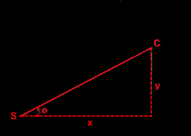

# Aiming Sample
Archived source code of the XNA 4.0 Aiming Sample from the Microsoft's Education Catalog for XNA. 

## Description
This sample shows how to turn one object to face another.  This can be useful for aiming, for example.

## Sample Overview
THe sample shows how to use trigonometry to make one 2D object aim towards another object as fast as it can.  This can be useful when making spotlights, gun turrets, and more.

THe function `TurnToFace` does the hard work in this sample.  You can copy it and use it in your game.

## Minimum Shader Profile
* Vertex Shader Model 1.1
* Pixel Shader Model 1.1

## Sample Controls
This samples uses the following keyboard and gamepad controls

| Action           | Keyboard Control (Windows)                        | Gamepad Control         | Windows Phone |
| ---------------- | ------------------------------------------------- | ----------------------- | ------------- |
| Move the cat.    | UP ARROW, DOWN ARROW, LEFT ARROW, AND RIGHT ARROW | Right Thumbstick, D-Pad | Touch         |
| Exit the sample. | ESC or ALT+F4                                     | **BACK**                | **BACK**      |

## How the Sample works
The core of this sample is in the function `TurnToFace`, which uses trigonometry to determine the "desired angle" that he spotlight should be facing, then turns toward that angle.  How do you calculate the desired angle?



In this diagram, S is the position of hte spot light, C is the position of hte cat, and "o" is the angle that the spot light should be facing in order to point at the cat, our "desired angle."

We know x and y: those are the difference in position between the cat's position and the spotlight's position.  Using trigonometry, we know that:

$tan(θ) = opposite / adjacent$

Substituting our values, the equation becomes:

$tan(o) = y / x$

Next, we take the arc tangent of both sides, giving us:

$o = arctan( y / x )$

Once we have the desired angle, it is relatively simple to turn towards that angle.  The code contains more details explaining this process.

## Extending the Sample
Try using `TurnToFace` to make one object turn toward another as it moves: it can be used to make objects move toward or away from one another.  To see how this would work, try adding the following code to the sample's **Update** function, right after *spotlightAngle* is calculated.

```cs
Vector2 spotlightVelocity = new Vector2();
spotlightVelocity.X = (float)Math.Cos(spotlightAngle);
spotlightVelocity.Y = (float)Math.Sin(spotlightAngle);
spotlightPosition += spotlightVelocity;
```

This will make the spotlight move towards the cat.  This could be useful in a variety of different situations.  For example, in a racing game, AI controlled cars could use `TurnToFace` to steer toward waypoints on the track.

© 2010 Microsoft Corporation. All rights reserved.